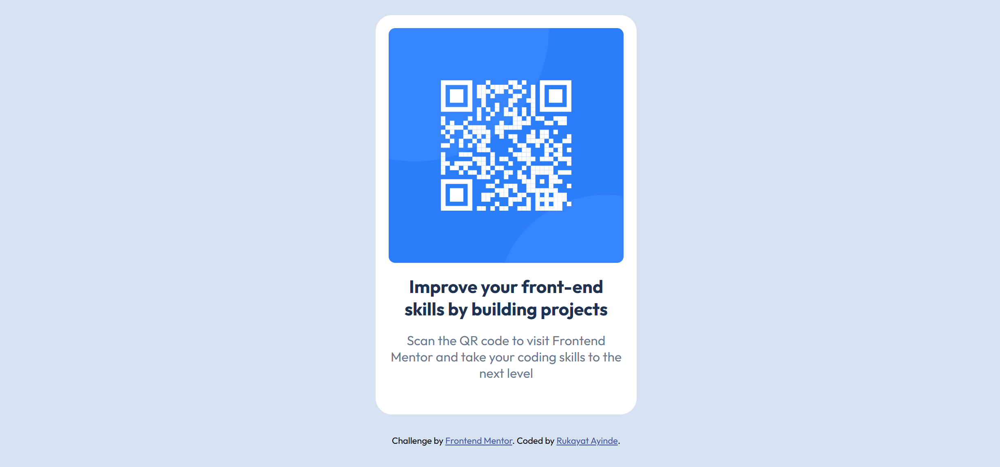

# Frontend Mentor - QR code component solution

This is a solution to the [QR code component challenge on Frontend Mentor](https://www.frontendmentor.io/challenges/qr-code-component-iux_sIO_H). 

## Table of contents

- [Overview](#overview)
  - [Screenshot](#screenshot)
  - [Links](#links)
- [My process](#my-process)
  - [Built with](#built-with)
  - [What I learned](#what-i-learned)
  - [Continued development](#continued-development)
  - [Useful resources](#useful-resources)
  - [AI Collaboration](#ai-collaboration)
- [Author](#author)

## Overview

### Screenshot


### Links

- Solution URL: [GitHub Repository](https://github.com/rukkah/QR-code-)
- Live Site URL: [Netlify](https://qrcode-design1.netlify.app/)

## My process

### Built with

- **HTML5** - Semantic markup for structure
- **CSS3** - Modern styling with custom properties
- **Flexbox** - For centering and layout alignment
- **Mobile-first workflow** - CSS written for mobile devices first, then enhanced with media queries
- **Google Fonts** - Outfit font family for typography
- **VS Code** - Code editor

### What I learned

This project taught me fundamental concepts about responsive web design and the mobile-first approach:

#### 1. **Mobile-First Workflow Fundamentals**
Mobile-first means writing CSS for the smallest screens first, then progressively enhancing for larger devices using `min-width` media queries:

```css
/* Mobile (default) - NO media query needed */
p {
    font-size: 16px;
}

.card {
    width: 100%;
    max-width: 300px;
    padding: 15px;
}

/* Tablet and desktop, -320px since the card layout remains same */
@media (min-width: 320px) {
    .card {
        padding: 16px;
        max-width: 320px;
    }
}
```

#### 2. **CSS Reset Best Practices**
Starting every project with a CSS reset ensures consistency across browsers:

```css
* {
    margin: 0;
    padding: 0;
    box-sizing: border-box;
}
```

#### 3. **Flexbox for Centering**
Using `display: flex` with `justify-content: center` and `align-items: center` makes centering content straightforward:

```css
.container {
    display: flex;
    justify-content: center;
    width: 100%;
    padding: 25px;
}
```

#### 4. **Responsive Images**
Making images responsive without breaking layout:

```css
img {
    width: 100%;
    display: block;
    border-radius: 8px;
}
```

#### 5. **Max-width for Constraint**
Using `max-width` keeps components appropriately sized while remaining responsive:

```css
.card {
    width: 100%;
    max-width: 300px;  /* prevents card from expanding too wide */
}
```

#### 6. **Typography in Mobile-First**
Applying typography to the body for inheritance, then customizing specific elements:

```css
body {
    font-family: 'Outfit', sans-serif;
}

h1 {
    font-size: 22px;
    color: hsl(218, 44%, 22%); /*using the style-guide.md*/
}

p {
    font-size: 16px;
    color: hsl(216, 15%, 48%);  /* gray text */
}
```

#### 7. **When to Add Media Queries**
Media queries are added AFTER all mobile styles are complete and tested, preventing unnecessary complexity.

#### 8. **Debugging Common Issues**
Fixed issues like:
- Extra HTML syntax errors affecting CSS parsing (malformed link tags)
- Overflow space from `min-height: 100vh` on containers
- Font sizing strategy (apply to body vs individual elements)

### Continued development

Areas I want to focus on in future projects:

1. **Advanced Layout Techniques**
   - CSS Grid for more complex layouts
   - Advanced Flexbox patterns
   - CSS custom properties (variables) for better maintainability

2. **Responsive Design Refinement**
   - More precise breakpoint testing
   - Touch-friendly UI components
   - Accessibility considerations (ARIA labels, semantic HTML)

3. **CSS Optimization**
   - BEM naming conventions for larger projects
   - Organizing CSS with SMACSS methodology
   - Performance optimization (minification, critical CSS)

4. **Interactive Features**
   - Adding hover states for better user feedback
   - Smooth transitions and animations
   - JavaScript interactivity

5. **Cross-browser Testing**
   - Testing on different browsers (Chrome, Firefox, Safari, Edge)
   - Mobile device testing beyond viewport simulation

### Useful resources

- [Frontend Mentor](https://www.frontendmentor.io/) - Great platform for realistic web design challenges
- [Flexbox Guide by CSS-Tricks](https://css-tricks.com/snippets/css/a-guide-to-flexbox/) - Visual guide to Flexbox properties
- [The Markdown Guide](https://www.markdownguide.org/) - Helpful for writing documentation

### AI Collaboration

I used **GitHub Copilot** during this project to:

**What worked well:**
- Quick debugging of CSS syntax errors (extra `">` in HTML link tag)
- Generating comprehensive mobile-first CSS templates as learning references
- Explaining complex concepts like mobile-first workflow vs desktop-first
- Helping identify layout issues and suggesting fixes
- Providing visual comparisons between my code and design mockups

**How it helped my learning:**
- Gave detailed explanations of WHY mobile-first is better (performance, mobile-first traffic, easier maintenance)
- Provided code examples showing differences between mobile-first and desktop-first approaches
- Helped me understand when to apply styles (base mobile CSS first, then media queries)
- Answered specific questions about mobile-first workflow without me having to search

**Challenges:**
- Initially needed clarification on terminology (viewport width vs monitor size)
- Had to learn when to ask for fixes vs. learning the concepts myself

---

## Author

- **Name:** [Rukayat Ayinde](http://127.0.0.1:5500/)
- **Email:** [ayinderukayat01@gmail.com]
- **Frontend Mentor:** [@rukkah](https://www.frontendmentor.io/profile/rukkah)
- **GitHub:** [@rukkah](https://github.com/rukkah)
- **LinkedIn:** [Ayinde Rukayat] (https://www.linkedin.com/in/ayinde-rukayat-220b3130b?utm_source=share_via&utm_content=profile&utm_medium=member_ios)

---

**Last updated:** May 9, 2026
